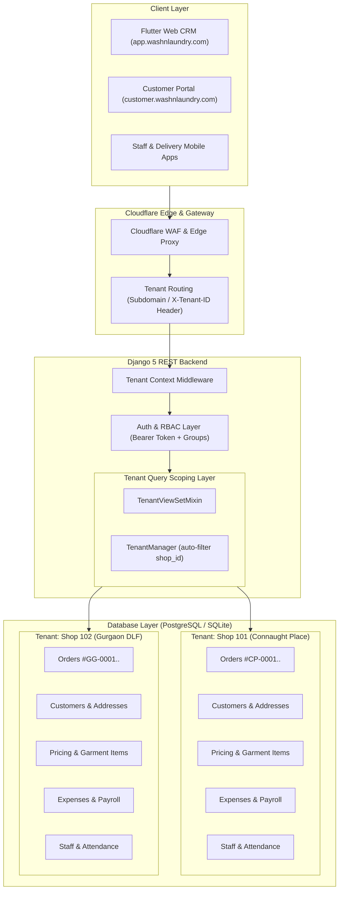
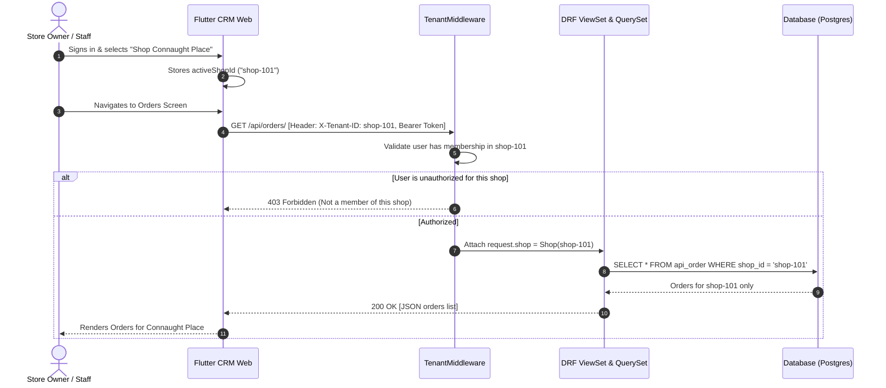
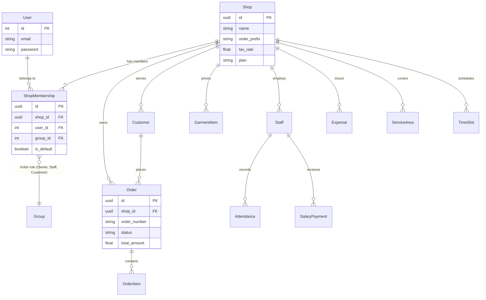

# Multi-Tenant Architecture & Data Isolation (Multi-Shop Support)

> **Jira Epic**: [KAN-132: [ARCH-MT] Multi-Tenant Architecture & Data Isolation](https://emailabhishek2.atlassian.net/browse/KAN-132)  
> **Status**: In Roadmap / Architectural Design  
> **Target Release**: WashNLaundry Multi-Store Core  

---

## 1. Executive Summary

WashNLaundry CRM is expanding from a single-shop operational model to a **multi-tenant, multi-store architecture**. This allows:
- A single centralized deployment serving multiple laundry and dry-cleaning store locations.
- Complete data isolation per shop tenant (customers, orders, inventory pricing, expenses, payroll, staff).
- Independent sequential order prefixing (e.g. `#CP-00001` vs `#GG-00001`).
- Multi-store owners managing multiple locations under a single login.
- Store-specific RBAC roles powered by Django Groups (`Owner`, `Staff`, `Customers`).

---

## 2. Jira Roadmap & Story Breakdown

| Key | Type | Summary | Scope |
| :--- | :---: | :--- | :--- |
| **[KAN-132](https://emailabhishek2.atlassian.net/browse/KAN-132)** | **Epic** | **[ARCH-MT] Multi-Tenant Architecture & Data Isolation (Multi-Shop Support)** | Overarching architectural initiative for complete shop isolation and multi-store operations. |
| **[KAN-133](https://emailabhishek2.atlassian.net/browse/KAN-133)** | Story | **Schema Migration & Tenant Foreign Keys (Shop-Scoped Data Isolation)** | Add `Shop` (Tenant) foreign keys across `Customer`, `Order`, `GarmentItem`, `Expense`, `Credit`, `Staff`, `Attendance`, and `TimeSlot`, backfilling existing data. |
| **[KAN-134](https://emailabhishek2.atlassian.net/browse/KAN-134)** | Story | **Tenant Context Resolution Middleware & Queryset Isolation** | Resolve active tenant from `X-Tenant-ID` header, subdomain, or user profile, automatically scoping all model querysets and writes to the tenant. |
| **[KAN-135](https://emailabhishek2.atlassian.net/browse/KAN-135)** | Story | **Multi-Tenant RBAC & Shop-Scoped Group Memberships** | Introduce `ShopMembership` model allowing users to hold different roles across different shops (e.g., Owner of Shop A, Staff of Shop B). |
| **[KAN-136](https://emailabhishek2.atlassian.net/browse/KAN-136)** | Story | **Tenant Provisioning & Self-Service Shop Onboarding Workflow** | Self-service registration enabling store owners to launch a new shop tenant, order prefix, tax configurations, and staff invitations. |
| **[KAN-137](https://emailabhishek2.atlassian.net/browse/KAN-137)** | Story | **CRM Frontend Multi-Tenant Context & Shop Switcher Integration** | Update Flutter Web CRM (`app.washnlaundry.com`) to inject `X-Tenant-ID` headers and provide a location/shop switcher in the top navigation bar. |

---

## 3. High-Level Architecture Diagram



---

## 4. Multi-Tenant Request & Isolation Lifecycle



---

## 5. Entity-Relationship & Tenancy Data Model



---

## 6. Core Tenancy Engineering Principles

### 1. Tenant Resolution Protocol
Every incoming request is resolved in `TenantMiddleware`:
1. **Header Inspection**: `X-Tenant-ID` header (primary mechanism for SPA & API calls).
2. **Subdomain Resolution**: `shop-subdomain.washnlaundry.com` (for public booking forms & customer portal).
3. **User Default Shop**: If no explicit header is provided, resolves to the user's default `ShopMembership`.
4. **Validation**: Confirms the authenticated user has an active membership for `request.shop`.

### 2. Zero-Leak Query Scoping (`TenantModel`)
All tenancy-scoped models inherit from `TenantModel`:
```python
class TenantModel(models.Model):
    shop = models.ForeignKey('Shop', on_delete=models.CASCADE, related_name='%(class)ss')
    
    objects = TenantManager()
    all_objects = models.Manager()

    class Meta:
        abstract = True
```
- `TenantManager.get_queryset()` automatically filters queries by the current thread's tenant context.
- Prevents cross-shop data leaks even if a view developer forgets to add `.filter(shop=...)`.

### 3. Tenant-Scoped RBAC & Role Hierarchy
Leverages Django Groups with tenant membership scoping:
```
Owner (rank 3)
   └── Staff (rank 2)
         └── Customer (rank 1)
   └── Customer (rank 1)
```
- Users can hold different roles in different shops (e.g., **Owner** of Location A, **Staff** of Location B).
- The `ShopMembership` model maps `(user, shop, group)`.
